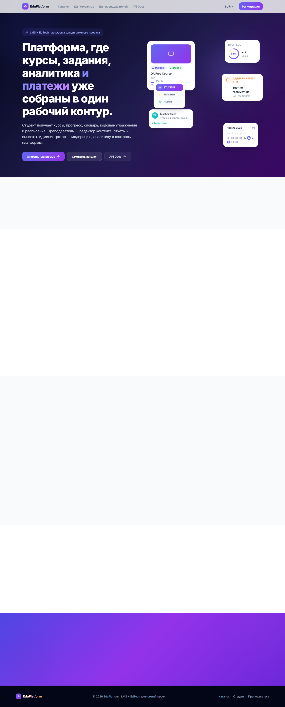
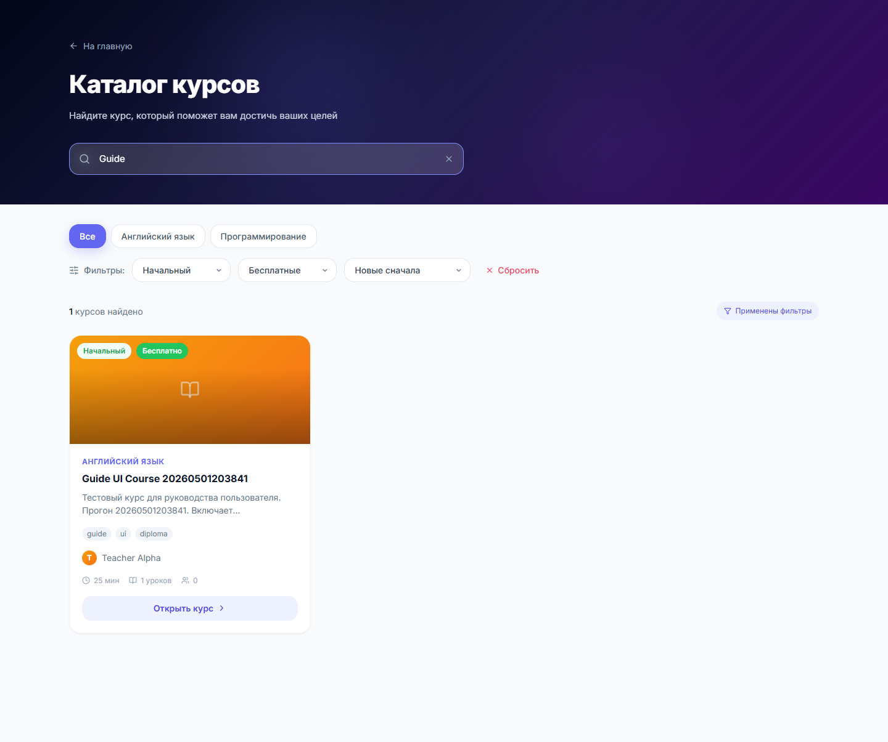
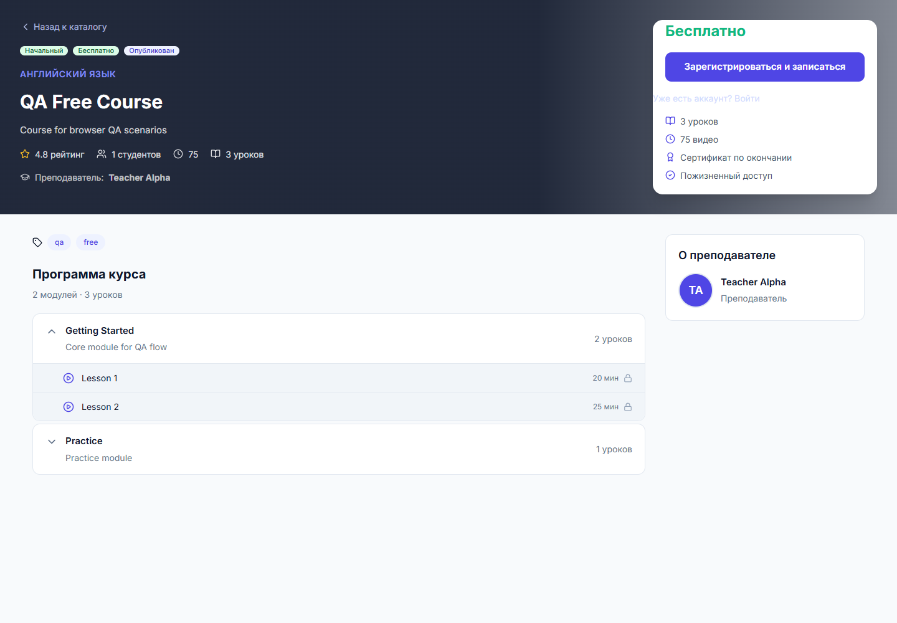

# 6.2.1 Публичная часть и каталог курсов

После перехода по адресу приложения открывается главная страница EduPlatform. Пользователь видит навигацию, кнопки входа и регистрации, а также переход к каталогу курсов. Установка отдельной программы не требуется: работа выполняется в браузере.

Рисунок 6.1 – Главная страница EduPlatform

Каталог доступен без авторизации. На странице есть строка поиска, переключатели дисциплин, фильтр уровня сложности, фильтр стоимости и сортировка. В проверочном сценарии использовался поиск по слову `Guide`, уровень «Начальный», стоимость «Бесплатные» и сортировка «Новые сначала».

Рисунок 6.2 – Каталог курсов с поиском, дисциплинами, уровнем, стоимостью и сортировкой

Карточка курса показывает название, дисциплину, преподавателя, теги, длительность, количество уроков и кнопку «Открыть курс». При сбросе фильтров пользователь возвращается к полному списку доступных курсов.

При открытии курса отображается подробная страница: описание, уровень, стоимость, преподаватель, теги, программа курса, модули и уроки. Гость может перейти к регистрации или входу. Студент после авторизации может записаться на бесплатный курс или перейти к покупке платного курса, если платежная конфигурация включена.

Рисунок 6.3 – Страница подробной информации о курсе
