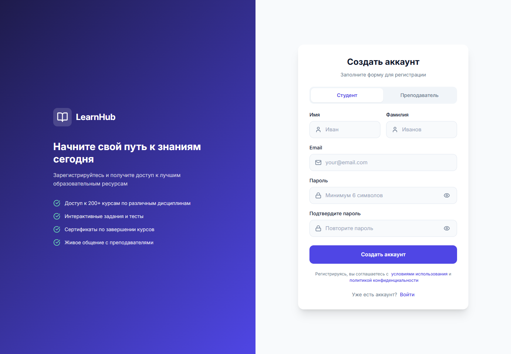
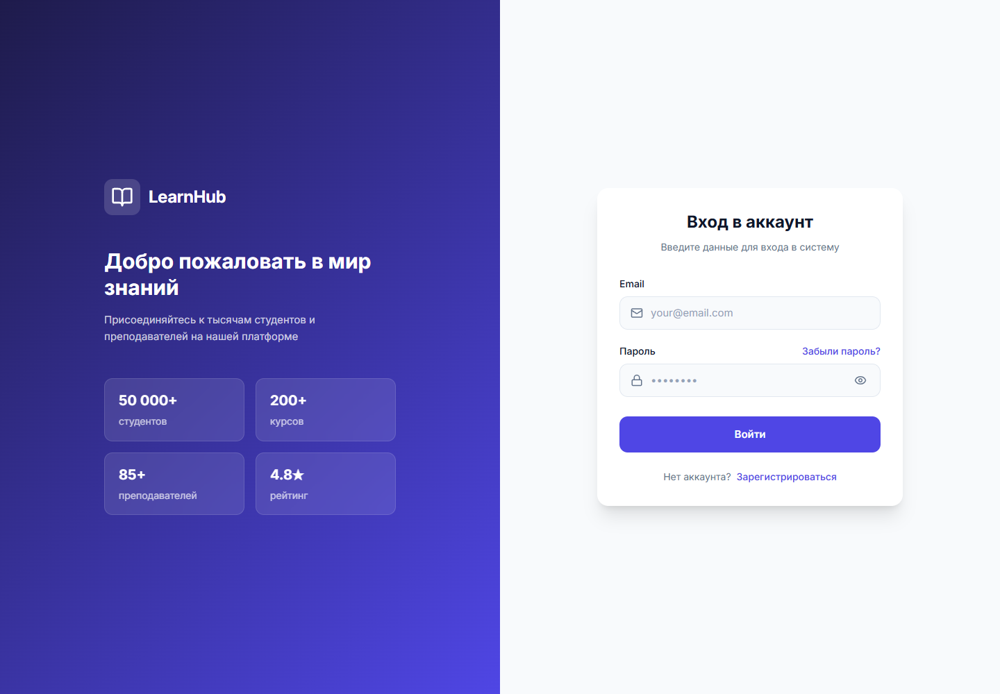

# 6.2.2 Регистрация и вход в систему

Для начала обучения пользователь создает учетную запись. В форме регистрации вводятся имя, фамилия, электронная почта, пароль и подтверждение пароля. После отправки формы система создает пользователя и открывает доступ к защищенным разделам в зависимости от роли.

Рисунок 6.4 – Форма регистрации пользователя

Если учетная запись уже создана, пользователь открывает страницу входа и вводит email и пароль. При ошибке авторизации интерфейс показывает сообщение об ошибке, а при успешном входе сохраняет сессию и перенаправляет пользователя в личный кабинет.

Рисунок 6.5 – Форма входа в систему

После авторизации верхняя панель меняется: появляются имя пользователя, роль, аватар, уведомления и меню профиля. В приложении используются разные кабинеты для студента, преподавателя и администратора. Поэтому набор пунктов меню зависит от роли пользователя.

Рисунок 6.6 – Интерфейс после авторизации
