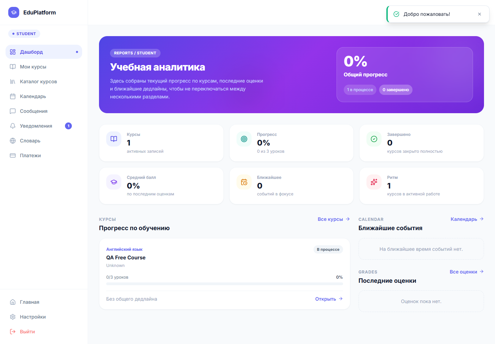

# 6.2.3 Общий интерфейс личного кабинета

После входа пользователь работает в личном кабинете. Слева расположено боковое меню, сверху — панель с уведомлениями и профилем. Активный пункт меню выделяется цветом, поэтому пользователь видит, в каком разделе он находится.

Рисунок 6.7 – Личный кабинет студента с боковой навигацией

У студента доступны дашборд, мои курсы, каталог, календарь, сообщения, уведомления, словарь и платежи. У преподавателя меню расширено разделами создания курса, проверки работ, журнала оценок, выплат и отчетов. У администратора доступны управление пользователями, курсами, дисциплинами, платежами, аналитикой и настройками.

Основная область экрана меняется без полной перезагрузки страницы. Формы и списки отображают состояния загрузки, пустые состояния и сообщения об ошибках. Кнопки отправки используются для явных действий: запись на курс, отправка задания, публикация курса, сохранение изменений или выставление оценки.
