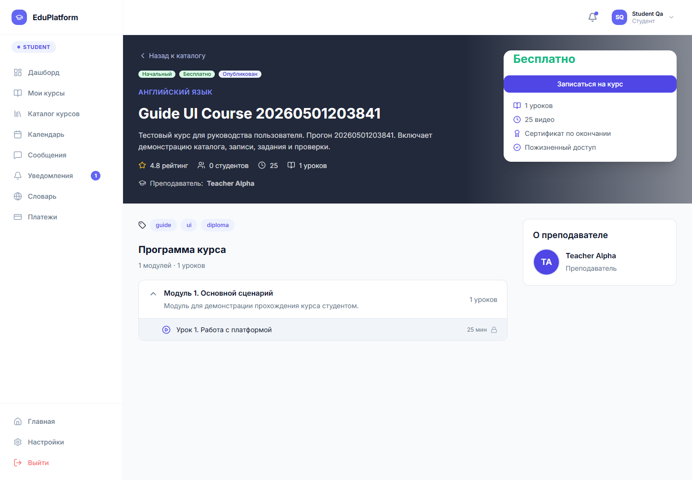
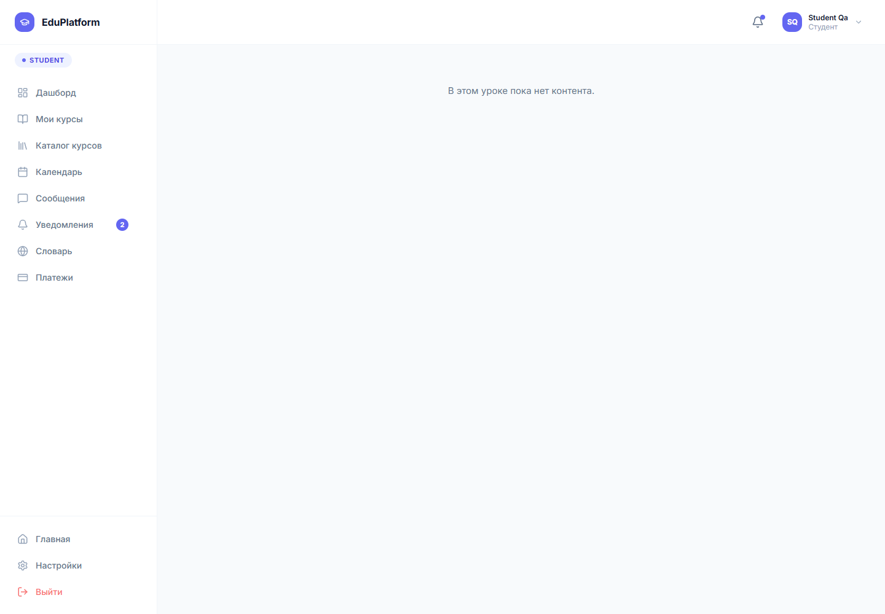
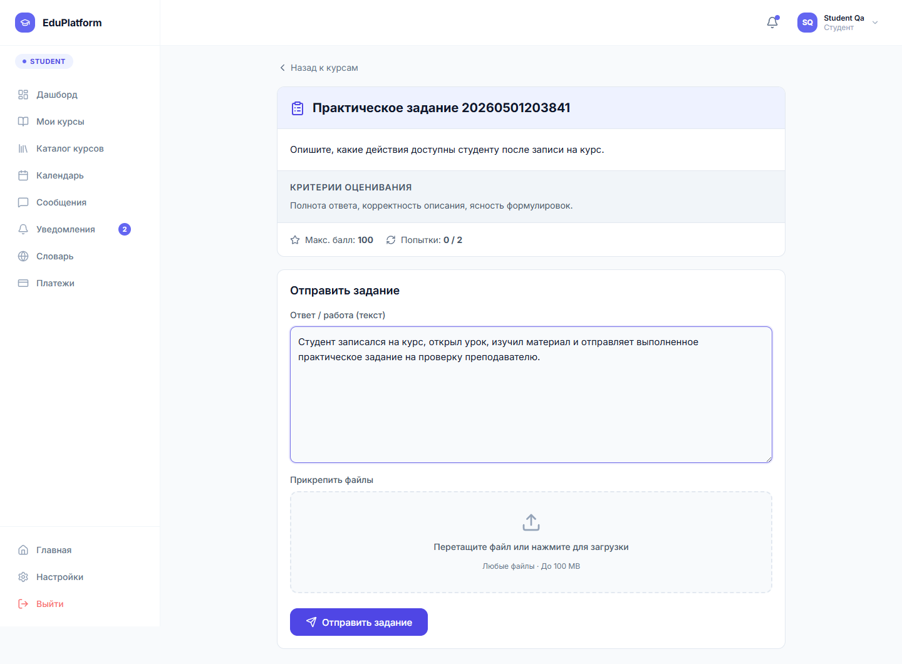
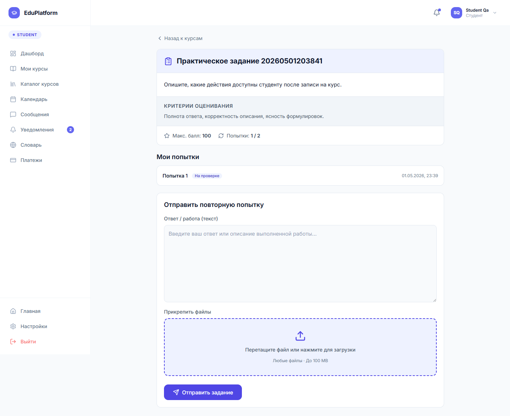
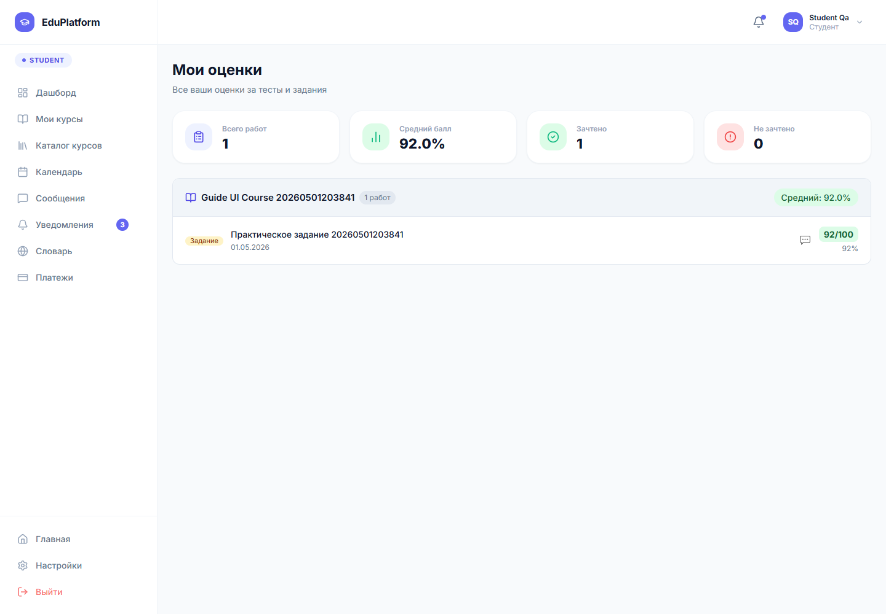
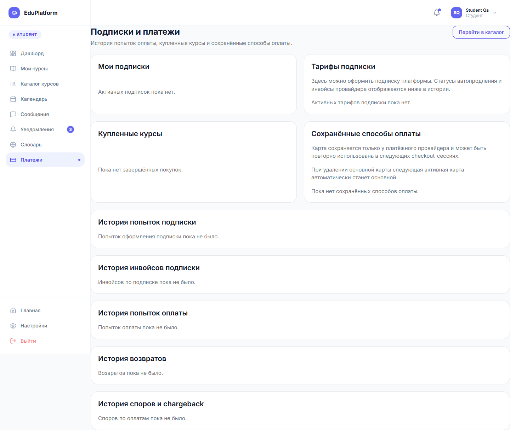

# 6.2.4 Работа студента

Студент начинает работу с дашборда. На нем отображаются текущие курсы, прогресс обучения, ближайшие события и последние оценки. Для выбора нового курса студент переходит в каталог и открывает страницу интересующего курса.

На странице курса студент видит описание, преподавателя, уровень, теги, программу и кнопку записи. В тестовом сценарии был создан курс `Guide UI Course`, после чего студент был записан на него и продолжил прохождение через урок и практическое задание.

Рисунок 6.8 – Просмотр курса студентом перед началом обучения

Урок открывается из программы курса или из раздела «Мои курсы». На странице урока студент изучает размещенный преподавателем материал: текстовые блоки, ссылки, файлы или другие учебные элементы.

Рисунок 6.9 – Просмотр учебного урока студентом

Практическое задание содержит описание, критерии оценивания, максимальный балл и количество попыток. Студент вводит текст ответа, при необходимости прикрепляет файл и нажимает кнопку «Отправить задание».

Рисунок 6.10 – Заполнение ответа на практическое задание

После отправки задание получает статус и становится доступным преподавателю для проверки. Студент может вернуться к курсу, дождаться оценки и посмотреть результат в разделе «Мои оценки».

Рисунок 6.11 – Страница задания после отправки работы

В разделе оценок отображается сводка: количество работ, средний балл, зачтенные и незачтенные задания. В проверочном сценарии преподаватель оценил работу на `92/100`, после чего результат появился в карточке курса.

Рисунок 6.12 – Раздел «Мои оценки» после проверки задания

Раздел «Платежи» показывает активные подписки, купленные курсы, сохраненные способы оплаты, историю попыток оплаты, инвойсы, возвраты и споры. Если покупок еще нет, пользователь видит пустые состояния и кнопку перехода в каталог.

Рисунок 6.13 – Раздел подписок и платежей студента
