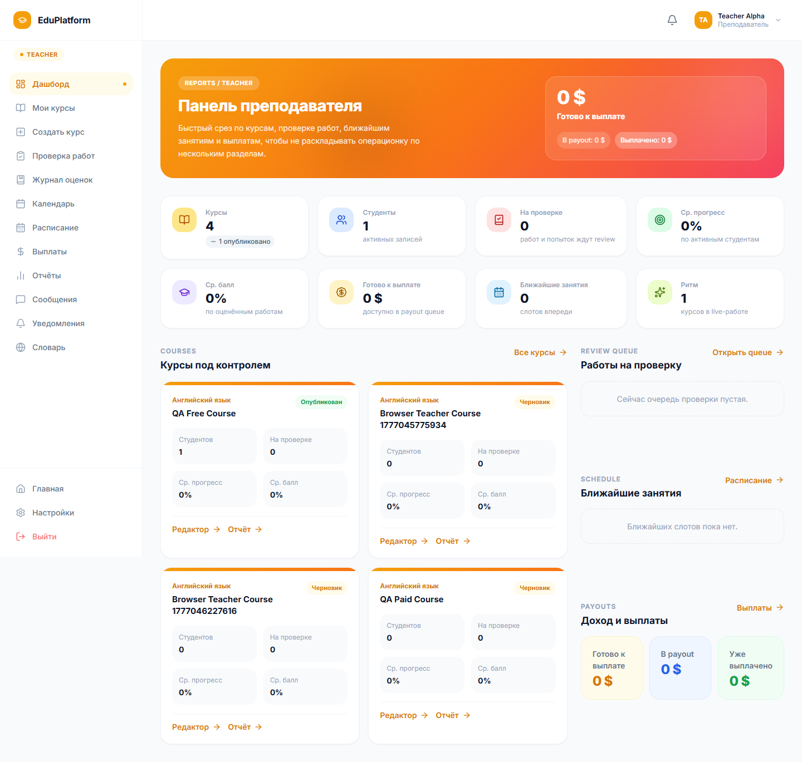
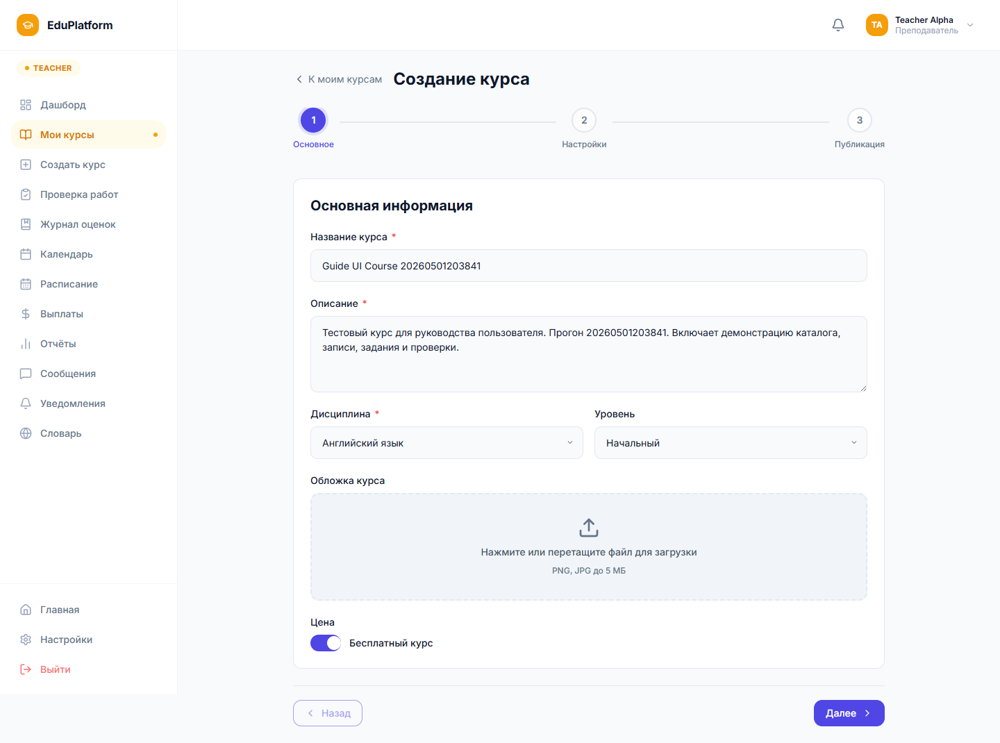
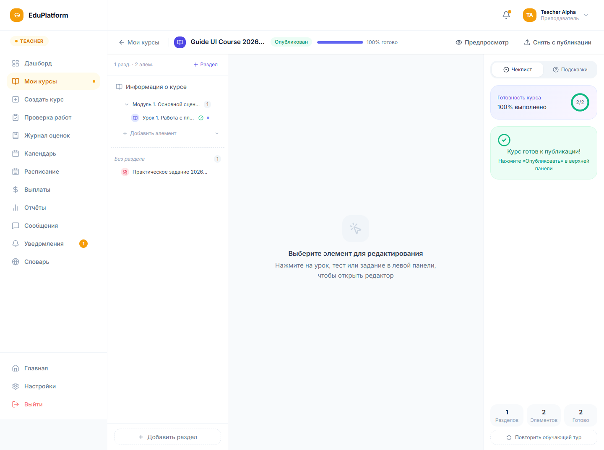
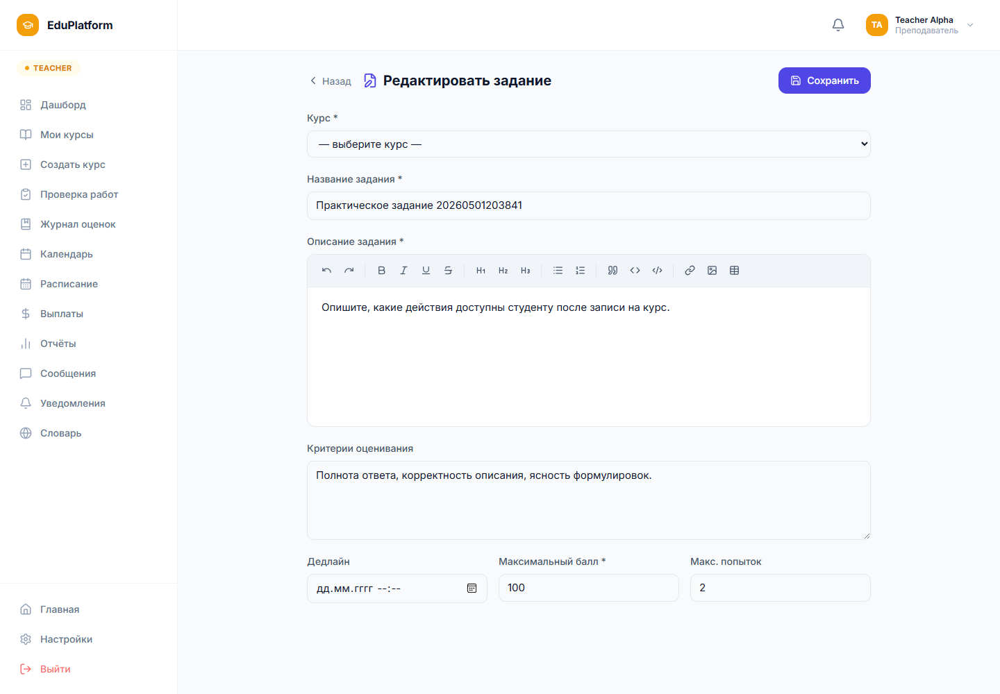
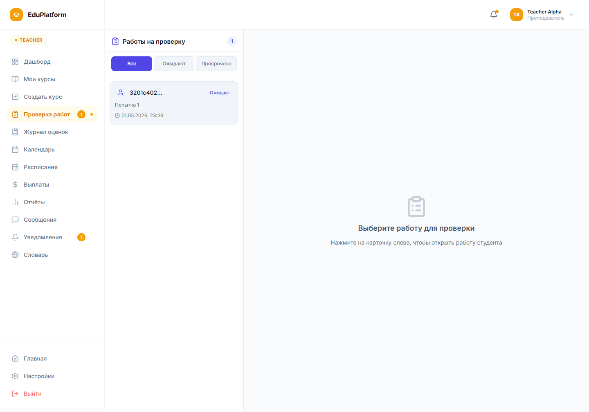
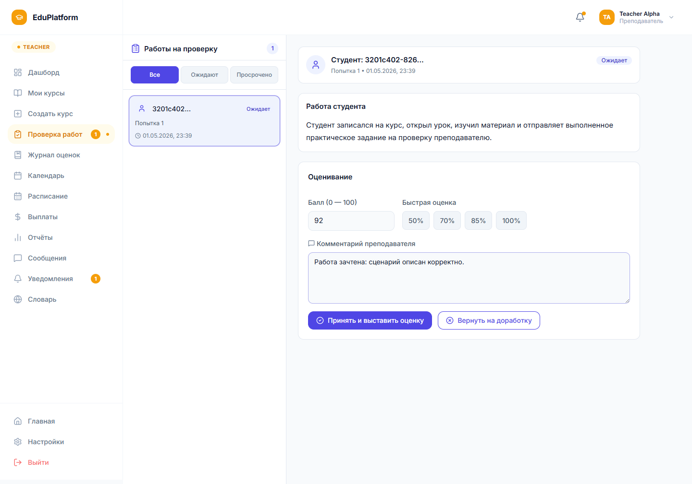
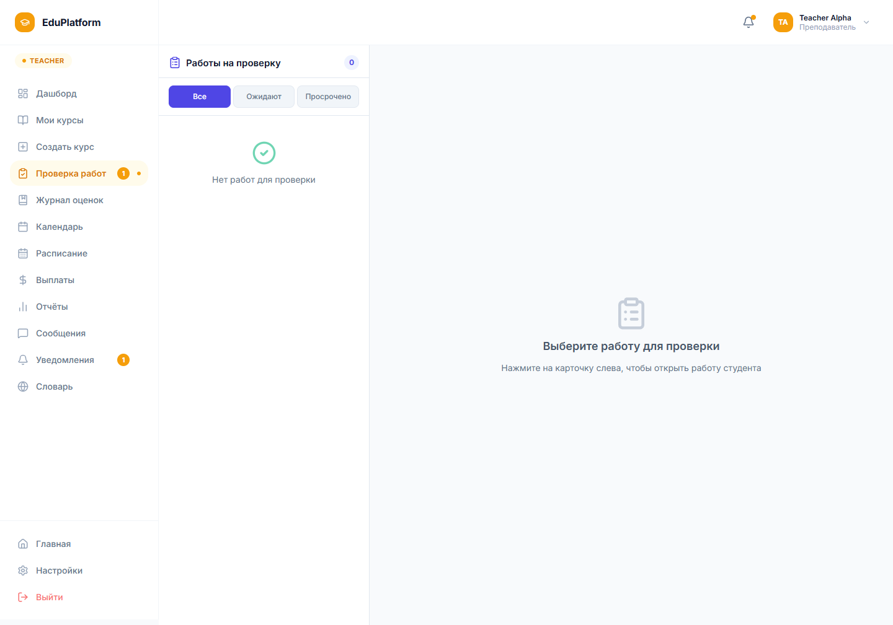

# 6.2.5 Работа преподавателя

Преподаватель управляет курсами из личного кабинета. На дашборде отображаются учебные показатели, активность студентов, работы к проверке и быстрые переходы к основным действиям.

Рисунок 6.14 – Дашборд преподавателя

Создание курса начинается с заполнения основной информации: название, описание, дисциплина, уровень, обложка и стоимость. Бесплатный курс включается отдельным переключателем. После заполнения преподаватель переходит к настройкам и публикации.

Рисунок 6.15 – Заполнение основных данных курса

Структура курса редактируется в Course Builder. Здесь преподаватель управляет разделами, уроками и учебными элементами. При первом входе открывается обучающий тур, который можно пропустить; дальше доступна рабочая область конструктора с деревом курса, редактором выбранного элемента и панелью готовности к публикации.

Рисунок 6.16 – Конструктор структуры курса

Для практических работ преподаватель создает задание, указывает описание, критерии оценивания, максимальный балл, количество попыток и формат отправки. В проверочном сценарии было создано задание с критериями полноты, точности и оформления ответа.

Рисунок 6.17 – Редактор практического задания

После отправки студентом работа появляется в разделе «Проверка работ». Слева отображается список отправленных работ и фильтры по статусам, справа — текст ответа студента и форма оценивания.

Рисунок 6.18 – Очередь работ на проверку

Преподаватель вводит балл, добавляет комментарий и выбирает действие: принять работу с оценкой или вернуть ее на доработку. В тестовом сценарии работа была принята с оценкой `92` и комментарием преподавателя.

Рисунок 6.19 – Заполнение формы оценивания

После сохранения работа исчезает из списка ожидающих проверки, а оценка становится видна студенту.

Рисунок 6.20 – Состояние раздела после проверки работы
