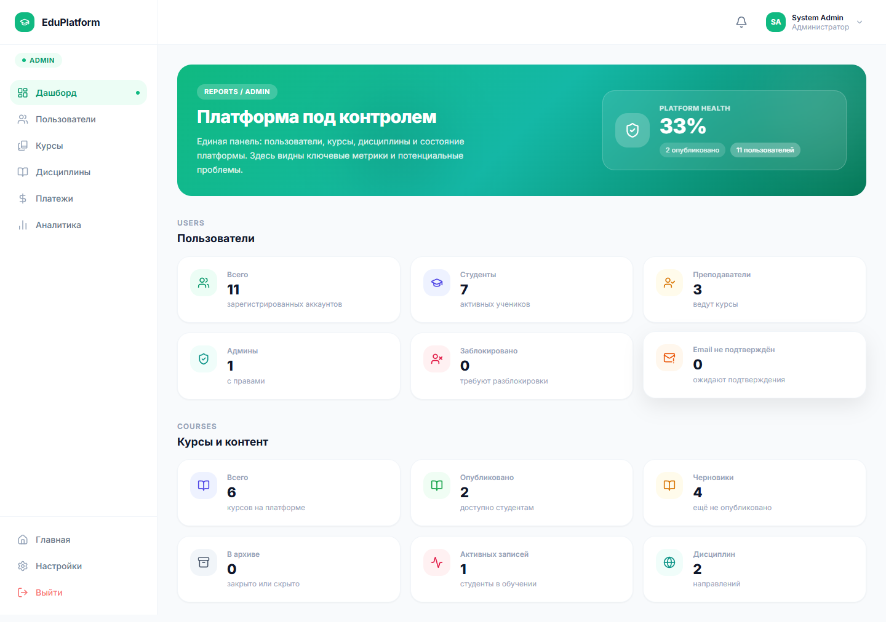
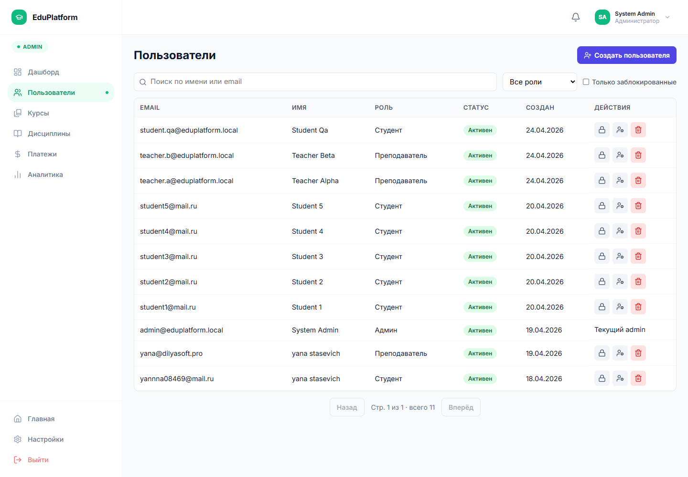
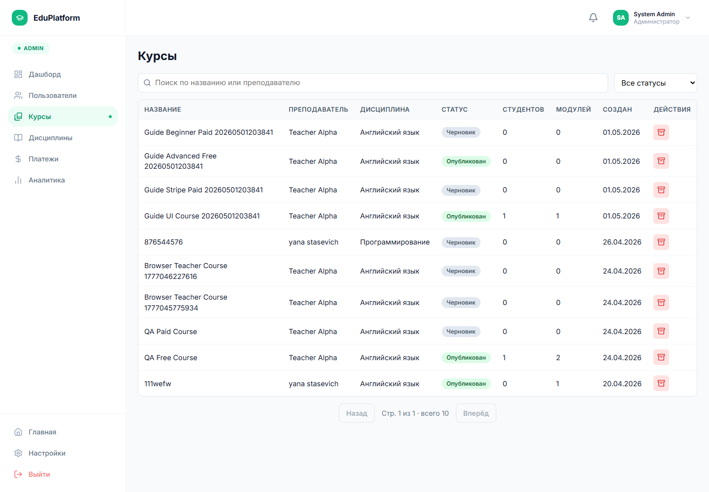

# 6.2.6 Работа администратора

Администратор использует отдельный кабинет для контроля платформы. На дашборде отображаются агрегированные показатели: пользователи, курсы, активность, платежные данные и состояние системы.

Рисунок 6.21 – Дашборд администратора

В разделе пользователей администратор просматривает список учетных записей, роли, email, дату регистрации и состояние блокировки. Доступны поиск, фильтрация по роли, создание пользователя, изменение роли, блокировка и разблокировка.

Рисунок 6.22 – Управление пользователями

В разделе курсов администратор контролирует опубликованные, черновые и архивные курсы. В таблице отображаются название, преподаватель, дисциплина, количество студентов, количество модулей и статус публикации. Для проблемных материалов доступна административная архивация.

Рисунок 6.23 – Управление курсами

Дополнительно администратор работает с дисциплинами, платежами, аналитикой и настройками платформы. Эти разделы используются для обслуживания справочников, проверки финансовых операций и изменения общих параметров системы.
