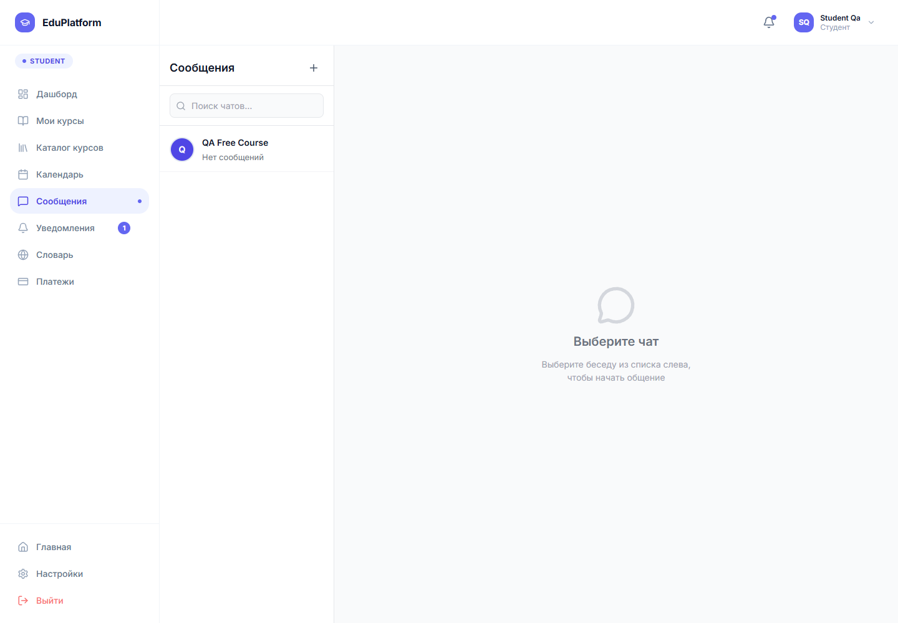
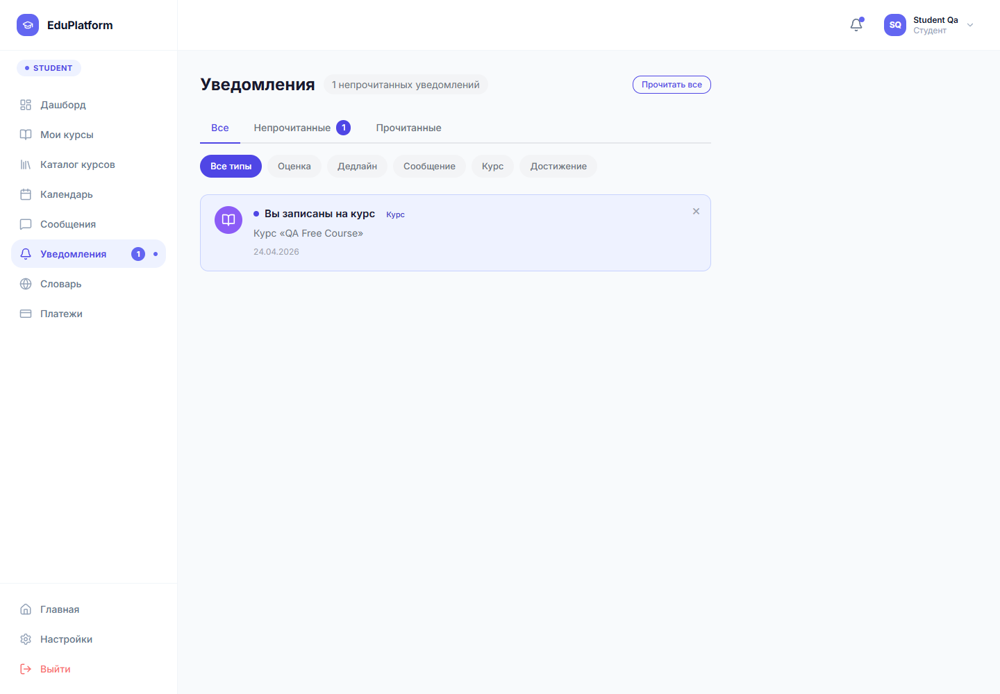

# 6.2.7 Сообщения и уведомления

Раздел сообщений предназначен для общения участников обучения. Пользователь выбирает чат, просматривает историю переписки и отправляет новое сообщение. Для курса может использоваться отдельный чат, где студент задает вопросы, а преподаватель отвечает по учебным материалам.

Рисунок 6.24 – Раздел сообщений

Уведомления показывают важные события: запись на курс, отправку задания, появление работы на проверку, выставление оценки и системные сообщения. Количество непрочитанных уведомлений отображается в боковом меню и в верхней панели.

Рисунок 6.25 – Страница уведомлений

Пользователь открывает уведомление, чтобы перейти к связанному действию: курсу, заданию, оценке или сообщению. Это сокращает количество ручных переходов между разделами.
