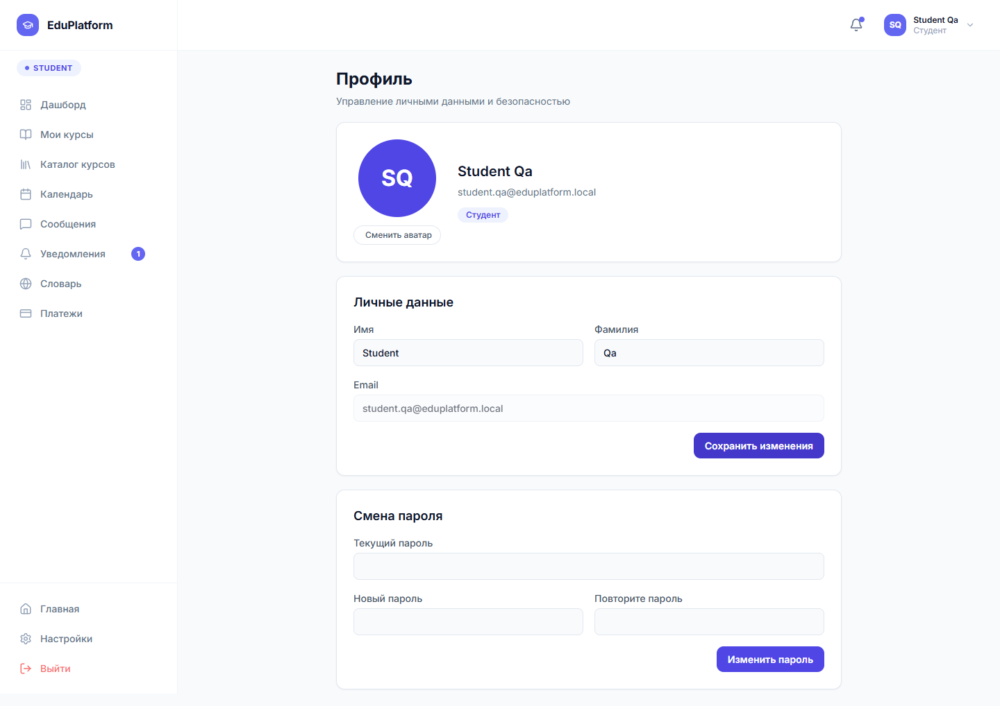

# 6.2.8 Профиль, выход и обработка ошибок

В профиле пользователь просматривает свои данные и параметры учетной записи. В верхней панели доступны имя, роль, аватар и меню пользователя. Через это меню можно перейти к профилю или выйти из системы.

Рисунок 6.26 – Страница профиля пользователя

При выходе из системы токен авторизации удаляется, а защищенные разделы становятся недоступны. При повторном открытии личного кабинета приложение перенаправляет пользователя на страницу входа.

Ошибки отображаются рядом с тем действием, при котором они возникли: в форме, в toast-уведомлении или в пустом состоянии страницы. Если данные не загружены, пользователь видит сообщение о проблеме вместо пустого экрана. Во время отправки форм кнопки переходят в состояние загрузки, чтобы снизить риск повторной отправки.

Если пользователь пытается открыть раздел без подходящей роли, интерфейс не предоставляет доступ к действию и возвращает пользователя к разрешенным страницам. Такой подход используется для кабинетов студента, преподавателя и администратора.
