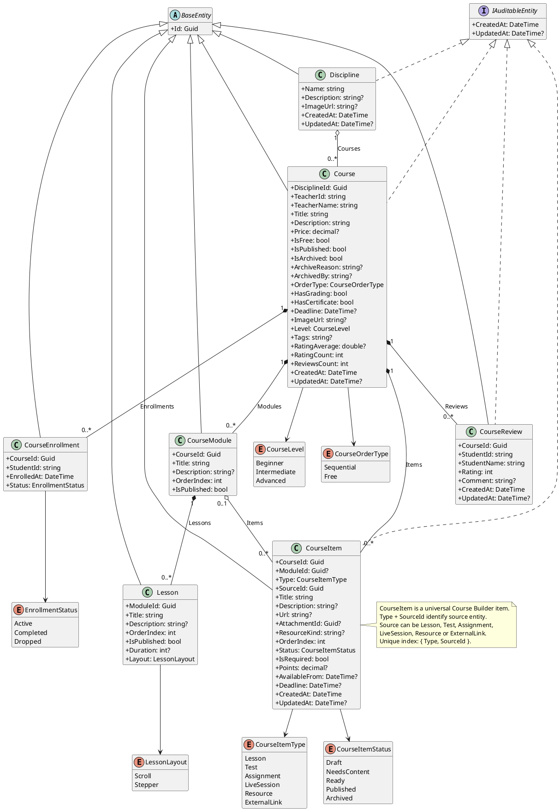

# Диаграмма классов Enterprise Architect: модуль Courses

Документ описывает class diagram для Enterprise Architect по фактическому коду модуля `Courses`.

Источник кода:

- `backend/src/Modules/Courses/Courses.Domain/Entities`
- `backend/src/Modules/Courses/Courses.Domain/Enums`
- `backend/src/Modules/Courses/Courses.Infrastructure/Persistence/CoursesDbContext.cs`

## 1. Назначение диаграммы

Диаграмма показывает доменную модель модуля `Courses`: курс, дисциплину, разделы курса, уроки, универсальные элементы курса, записи студентов и отзывы.

Главная идея диаграммы:

```text
Discipline
  -> Course
    -> CourseModule
      -> Lesson
      -> CourseItem
    -> CourseEnrollment
    -> CourseReview
    -> CourseItem
```

`CourseItem` является новой универсальной сущностью Course Builder. Она позволяет хранить в структуре курса не только уроки, но и тесты, задания, live-занятия, материалы и внешние ссылки.

## 2. Как создать в Enterprise Architect

1. Создать package: `Courses Module`.
2. Внутри package создать diagram типа `UML Class`.
3. Назвать диаграмму: `Courses Domain Class Diagram`.
4. Добавить классы:
   - `Discipline`
   - `Course`
   - `CourseModule`
   - `Lesson`
   - `CourseItem`
   - `CourseEnrollment`
   - `CourseReview`
5. Добавить enum-ы:
   - `CourseLevel`
   - `CourseOrderType`
   - `EnrollmentStatus`
   - `CourseItemType`
   - `CourseItemStatus`
   - `LessonLayout`
6. Добавить интерфейсы/базовые типы как внешние элементы:
   - `BaseEntity`
   - `IAuditableEntity`
7. Провести связи с кратностями из раздела 6.
8. Для `CourseItem` добавить note: `Type + SourceId identify source entity. Source can be Lesson, Test, Assignment, LiveSession, Resource or ExternalLink.`

## 3. Базовые элементы

### BaseEntity

Stereotype: `<<abstract>>`

Атрибуты:

| Attribute | Type |
|---|---|
| Id | Guid |

Комментарий: общий базовый класс для доменных сущностей.

### IAuditableEntity

Stereotype: `<<interface>>`

Атрибуты:

| Attribute | Type |
|---|---|
| CreatedAt | DateTime |
| UpdatedAt | DateTime? |

Комментарий: интерфейс для сущностей с датами создания и обновления.

## 4. Классы модуля Courses

### Discipline

Extends: `BaseEntity`

Implements: `IAuditableEntity`

Назначение: дисциплина или категория курса.

Атрибуты:

| Attribute | Type | Notes |
|---|---|---|
| Name | string | required, max 100 |
| Description | string? | max 1000 |
| ImageUrl | string? | max 500 |
| CreatedAt | DateTime | from `IAuditableEntity` |
| UpdatedAt | DateTime? | from `IAuditableEntity` |
| Courses | ICollection\<Course> | navigation |

### Course

Extends: `BaseEntity`

Implements: `IAuditableEntity`

Назначение: верхнеуровневая сущность курса.

Атрибуты:

| Attribute | Type | Notes |
|---|---|---|
| DisciplineId | Guid | FK to `Discipline` |
| TeacherId | string | required, max 450 |
| TeacherName | string | required, max 200 |
| Title | string | required, max 200 |
| Description | string | required, max 5000 |
| Price | decimal? | decimal(18,2) |
| IsFree | bool | free/paid flag |
| IsPublished | bool | publication flag |
| IsArchived | bool | archive flag |
| ArchiveReason | string? | reason text |
| ArchivedBy | string? | admin/teacher id |
| OrderType | CourseOrderType | string conversion |
| HasGrading | bool | course has gradebook |
| HasCertificate | bool | default false |
| Deadline | DateTime? | course deadline |
| ImageUrl | string? | max 500 |
| Level | CourseLevel | string conversion |
| Tags | string? | max 1000 |
| RatingAverage | double? | aggregate rating |
| RatingCount | int | default 0 |
| ReviewsCount | int | default 0 |
| CreatedAt | DateTime | from `IAuditableEntity` |
| UpdatedAt | DateTime? | from `IAuditableEntity` |
| Discipline | Discipline | navigation |
| Modules | ICollection\<CourseModule> | navigation |
| Items | ICollection\<CourseItem> | navigation |
| Enrollments | ICollection\<CourseEnrollment> | navigation |
| Reviews | ICollection\<CourseReview> | navigation |

### CourseModule

Extends: `BaseEntity`

Назначение: раздел курса. В интерфейсе может отображаться как section/module.

Атрибуты:

| Attribute | Type | Notes |
|---|---|---|
| CourseId | Guid | FK to `Course` |
| Title | string | required, max 200 |
| Description | string? | max 1000 |
| OrderIndex | int | order inside course |
| IsPublished | bool | module publication flag |
| Course | Course | navigation |
| Lessons | ICollection\<Lesson> | navigation |
| Items | ICollection\<CourseItem> | navigation |

### Lesson

Extends: `BaseEntity`

Назначение: урок внутри раздела курса.

Атрибуты:

| Attribute | Type | Notes |
|---|---|---|
| ModuleId | Guid | FK to `CourseModule` |
| Title | string | required, max 200 |
| Description | string? | max 1000 |
| OrderIndex | int | order inside module |
| IsPublished | bool | lesson publication flag |
| Duration | int? | duration in minutes |
| Layout | LessonLayout | string conversion, max 30 |
| Module | CourseModule | navigation |

### CourseItem

Extends: `BaseEntity`

Implements: `IAuditableEntity`

Назначение: универсальный элемент структуры курса для нового Course Builder.

Атрибуты:

| Attribute | Type | Notes |
|---|---|---|
| CourseId | Guid | FK to `Course` |
| ModuleId | Guid? | optional FK to `CourseModule` |
| Type | CourseItemType | string conversion, max 50 |
| SourceId | Guid | source entity id |
| Title | string | required, max 200 |
| Description | string? | max 1000 |
| Url | string? | max 2000 |
| AttachmentId | Guid? | file attachment id for resource |
| ResourceKind | string? | max 50 |
| OrderIndex | int | order inside module/unsectioned list |
| Status | CourseItemStatus | string conversion, max 50 |
| IsRequired | bool | default true |
| Points | decimal? | decimal(18,2) |
| AvailableFrom | DateTime? | availability start |
| Deadline | DateTime? | item deadline |
| CreatedAt | DateTime | from `IAuditableEntity` |
| UpdatedAt | DateTime? | from `IAuditableEntity` |
| Course | Course | navigation |
| Module | CourseModule? | optional navigation |

Важно для диаграммы:

`CourseItem` имеет уникальный индекс `{ Type, SourceId }`. Это значит, что один исходный объект может быть представлен в структуре курса только одним `CourseItem`.

`CourseItem.SourceId` не является обычным FK внутри `CoursesDbContext`. Он указывает на источник в зависимости от `Type`:

| Type | Source entity |
|---|---|
| Lesson | `Lesson` |
| Test | external `Tests.Domain.Entities.Test` |
| Assignment | external `Assignments.Domain.Entities.Assignment` |
| LiveSession | external `Scheduling.Domain.Entities.ScheduleSlot` |
| Resource | standalone resource |
| ExternalLink | standalone external link |

В Enterprise Architect это лучше показать как note рядом с `CourseItem`, а не как жёсткую association ко всем внешним модулям.

### CourseEnrollment

Extends: `BaseEntity`

Назначение: запись студента на курс.

Атрибуты:

| Attribute | Type | Notes |
|---|---|---|
| CourseId | Guid | FK to `Course` |
| StudentId | string | required, max 450 |
| EnrolledAt | DateTime | default UTC now |
| Status | EnrollmentStatus | string conversion, max 50 |
| Course | Course | navigation |

Индексы:

- `{ CourseId, StudentId }`
- `StudentId`

### CourseReview

Extends: `BaseEntity`

Implements: `IAuditableEntity`

Назначение: отзыв и оценка курса студентом.

Атрибуты:

| Attribute | Type | Notes |
|---|---|---|
| CourseId | Guid | FK to `Course` |
| StudentId | string | required, max 450 |
| StudentName | string | required, max 200 |
| Rating | int | rating value |
| Comment | string? | max 5000 |
| CreatedAt | DateTime | from `IAuditableEntity` |
| UpdatedAt | DateTime? | from `IAuditableEntity` |
| Course | Course | navigation |

Индексы:

- `CourseId`
- unique `{ CourseId, StudentId }`

Это значит, что один студент может оставить только один отзыв на один курс.

## 5. Enum-ы

### CourseLevel

```text
Beginner
Intermediate
Advanced
```

### CourseOrderType

```text
Sequential
Free
```

### EnrollmentStatus

```text
Active
Completed
Dropped
```

### CourseItemType

```text
Lesson
Test
Assignment
LiveSession
Resource
ExternalLink
```

### CourseItemStatus

```text
Draft
NeedsContent
Ready
Published
Archived
```

### LessonLayout

```text
Scroll = 0
Stepper = 1
```

## 6. Связи для Enterprise Architect

### Наследование и реализации

| Source | Relation | Target |
|---|---|---|
| `Discipline` | Generalization | `BaseEntity` |
| `Course` | Generalization | `BaseEntity` |
| `CourseModule` | Generalization | `BaseEntity` |
| `Lesson` | Generalization | `BaseEntity` |
| `CourseItem` | Generalization | `BaseEntity` |
| `CourseEnrollment` | Generalization | `BaseEntity` |
| `CourseReview` | Generalization | `BaseEntity` |
| `Discipline` | Realization | `IAuditableEntity` |
| `Course` | Realization | `IAuditableEntity` |
| `CourseItem` | Realization | `IAuditableEntity` |
| `CourseReview` | Realization | `IAuditableEntity` |

### Ассоциации

| Source | Target | Multiplicity | EA relation | Delete behavior |
|---|---|---|---|---|
| `Discipline` | `Course` | `1` to `0..*` | Association / Aggregation | Restrict |
| `Course` | `CourseModule` | `1` to `0..*` | Composition | Cascade |
| `Course` | `CourseItem` | `1` to `0..*` | Composition | Cascade |
| `Course` | `CourseEnrollment` | `1` to `0..*` | Composition | Cascade |
| `Course` | `CourseReview` | `1` to `0..*` | Composition | Cascade |
| `CourseModule` | `Lesson` | `1` to `0..*` | Composition | Cascade |
| `CourseModule` | `CourseItem` | `0..1` to `0..*` | Aggregation / Association | SetNull |

### Enum dependencies

| Class | Enum |
|---|---|
| `Course` | `CourseLevel` |
| `Course` | `CourseOrderType` |
| `CourseItem` | `CourseItemType` |
| `CourseItem` | `CourseItemStatus` |
| `CourseEnrollment` | `EnrollmentStatus` |
| `Lesson` | `LessonLayout` |

## 7. Рекомендуемая раскладка на диаграмме

```text
                       <<abstract>>
                       BaseEntity
                           ^
                           |
 ----------------------------------------------------------------
 |          |             |              |             |          |
Discipline Course   CourseModule      Lesson     CourseItem  CourseEnrollment CourseReview

IAuditableEntity should be placed above/right and connected by realization to:
Discipline, Course, CourseItem, CourseReview.

Enums should be placed on the right side:
CourseLevel, CourseOrderType, CourseItemType, CourseItemStatus, EnrollmentStatus, LessonLayout.
```

Более удобная визуальная структура:

```text
Discipline 1 ---- 0..* Course
                       |
                       | 1
                       |---------------- 0..* CourseModule
                       |                         |
                       |                         | 1 ---- 0..* Lesson
                       |                         |
                       |                         | 0..1 ---- 0..* CourseItem
                       |
                       | 1 ---- 0..* CourseItem
                       |
                       | 1 ---- 0..* CourseEnrollment
                       |
                       | 1 ---- 0..* CourseReview
```

## 8. PlantUML-черновик

Этот код можно использовать как черновик для визуальной сверки перед ручным переносом в Enterprise Architect.



## 9. Краткое описание для диплома

Диаграмма классов модуля `Courses` отражает структуру учебного курса. Центральным классом является `Course`, который относится к определённой дисциплине, принадлежит преподавателю и содержит набор разделов, элементов курса, записей студентов и отзывов. Разделы курса представлены классом `CourseModule`, внутри которого могут находиться уроки `Lesson` и универсальные элементы `CourseItem`.

Класс `CourseItem` введён для поддержки Course Builder. Он обобщает разные типы учебных элементов и позволяет хранить в структуре курса уроки, тесты, задания, live-занятия, материалы и внешние ссылки. Такая модель делает курс не просто цепочкой разделов и уроков, а полноценным учебным маршрутом.

Запись студента на курс хранится в `CourseEnrollment`, а отзывы и рейтинг - в `CourseReview`. Агрегированные значения рейтинга дополнительно хранятся в `Course`, что ускоряет отображение каталога курсов.

